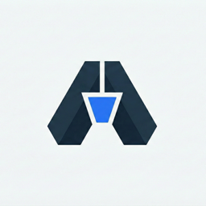
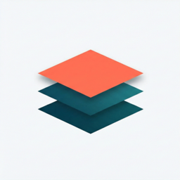

  

<h1 align="center">Hi, I'm Mason 👋</h1>

  Co-founder &amp; CEO @ <a href="https://ashlr.ai"><b>Ashlr AI</b></a> — building AI-native developer tools, vertical AI products, and the occasional infinite encyclopedia. <i>Digital Masonry.</i>

  
  
  
  
  
  

  
  
  

---

<h2 align="center">🛠️ Dev Tools we ship at <a href="https://github.com/ashlrai">@ashlrai</a></h2>

<table>
  <tr>
    <td width="33%" valign="top" align="left">
      

        
        <b><a href="https://github.com/ashlrai/ashlrcode">ashlrcode</a></b> 
        Multi-provider AI coding agent for the terminal.
      

      <pre><code>bun install -g ashlrcode</code></pre>
    </td>
    <td width="33%" valign="top" align="left">
      

        
        <b><a href="https://github.com/ashlrai/ashlr-plugin">ashlr-plugin</a></b> 
        Cut Claude Code token usage by 57% on real codebases.
      

      <pre><code>curl -fsSL plugin.ashlr.ai/install.sh | bash</code></pre>
    </td>
    <td width="33%" valign="top" align="left">
      

        
        <b><a href="https://github.com/ashlrai/phantom-secrets">phantom-secrets</a></b> 
        Stop AI agents from leaking your API keys. Local proxy + MCP.
      

      <pre><code>npx phantom-secrets init</code></pre>
    </td>
  </tr>
  <tr>
    <td width="33%" valign="top" align="left">
      

        
        <b><a href="https://github.com/ashlrai/ashlr-stack">ashlr-stack</a></b> 
        One command to provision, wire &amp; operate your entire dev stack.
      

      <pre><code>brew install ashlrai/ashlr/stack</code></pre>
    </td>
    <td width="33%" valign="top" align="left">
      

        
        <b><a href="https://github.com/ashlrai/webfetch">webfetch</a></b> 
        License-first image search across 24 providers, MCP-native.
      

      <pre><code>npm i -g getwebfetch</code></pre>
    </td>
    <td width="33%" valign="top" align="left">
      

        
        <b><a href="https://github.com/ashlrai/ashlr-pulse">ashlr-pulse</a></b> 
        Mission control for agentic-engineering teams. Peer-visible.
      

      <pre><code>curl -fsSL pulse.ashlr.ai/install.sh | sh</code></pre>
    </td>
  </tr>
  <tr>
    <td width="33%" valign="top" align="left">
      

        
        <b><a href="https://github.com/ashlrai/morphkit">morphkit</a></b> 
        React/TypeScript web app → production SwiftUI iOS in seconds.
      

      <pre><code>npx morphkit-cli plan ./app</code></pre>
    </td>
    <td width="33%" valign="top" align="left">
      

        
        <b><a href="https://github.com/ashlrai/idle">idle</a></b> 
        DePIN orchestrator menu-bar app for macOS passive earnings.
      

      <pre><code>brew install --cask ashlrai/idle/idle</code></pre>
    </td>
    <td width="33%" valign="top" align="left">
      

        
        <b><a href="https://github.com/ashlrai/binshield">binshield</a></b> 
        Snyk for binaries. Ghidra + AI + YARA for npm supply-chain risk.
      

      <pre><code>pnpm add -D binshield</code></pre>
    </td>
  </tr>
  <tr>
    <td width="33%" valign="top" align="left">
      

        
        <b><a href="https://github.com/ashlrai/ashlr-workbench">ashlr-workbench</a></b> 
        Local agent workbench: OpenHands + Goose + Aider + ashlrcode.
      

      <pre><code>git clone ashlrai/ashlr-workbench</code></pre>
    </td>
    <td width="33%" valign="top" align="center">
       
      <a href="https://github.com/ashlrai">
        <b>and 8+ more →</b> 
        Browse the full org
      </a>
    </td>
    <td width="33%" valign="top" align="left">
      

        
        <b><a href="https://github.com/ashlrai/ashlr-core-efficiency">core-efficiency</a></b> 
        Token-efficiency primitives that power <code>ashlr-plugin</code>.
      

      <pre><code>npm i @ashlr/core-efficiency</code></pre>
    </td>
  </tr>
</table>

---

<h2 align="center">🧠 Vertical AI Products</h2>

Deep-on-workflow AI software for specific professions.

<table>
  <tr>
    <td width="33%" valign="top" align="left">
      

        
        <b><a href="https://measurably.dev">measurably.dev</a></b> 
        Strava for AI usage. Track, measure, and improve your AI effectiveness.
      

    </td>
    <td width="33%" valign="top" align="left">
      

        
        <b><a href="https://bi.ashlr.ai">bi.ashlr.ai</a></b> 
        Ashlr BI — smarter business decisions, less chaos.
      

    </td>
    <td width="33%" valign="top" align="left">
      

        
        <b><a href="https://trytriage.ai">trytriage.ai</a></b> 
        AI-enabled email copilot for insurance agencies. Inbox, sorted.
      

    </td>
  </tr>
  <tr>
    <td width="33%" valign="top" align="left">
      

        
        <b><a href="https://trykoala.ai">trykoala.ai</a></b> 
        Agentic personal finance — your money, understood.
      

    </td>
    <td width="33%" valign="top" align="left">
      

        
        <b><a href="https://tryprobe.io">tryprobe.io</a></b> 
        Probe AI — deep research platform for high-stakes decisions.
      

    </td>
    <td width="33%" valign="top" align="center">
       
      <a href="https://ashlr.ai">
        <b>more at ashlr.ai →</b>
      </a>
    </td>
  </tr>
</table>

---

<h2 align="center">📚 AI Encyclopedias</h2>

Definitive, AI-augmented reference sites for the people who matter.

<table>
  <tr>
    <td width="25%" align="center" valign="top">
      <a href="https://yeuniverse.com">
        <h3>🎤 Yeuniverse</h3>
      </a>
      The definitive Kanye West universe. 
      <code>yeuniverse.com</code>
    </td>
    <td width="25%" align="center" valign="top">
      <a href="https://swiftiepedia.com">
        <h3>✨ Swiftiepedia</h3>
      </a>
      Every era, every track, every easter egg. 
      <code>swiftiepedia.com</code>
    </td>
    <td width="25%" align="center" valign="top">
      <a href="https://dontoliverse.com">
        <h3>🌵 Dontoliverse</h3>
      </a>
      Every album, era &amp; Cactus Jack thread. 
      <code>dontoliverse.com</code>
    </td>
    <td width="25%" align="center" valign="top">
      <a href="https://elon.ashlr.ai">
        <h3>🚀 Elon-verse</h3>
      </a>
      Every company, tweet &amp; rabbit hole. 
      <code>elon.ashlr.ai</code>
    </td>
  </tr>
</table>

---

<h2 align="center">🎲 Other Projects</h2>

<table>
  <tr>
    <td width="50%" valign="top" align="left">
      

        <b>💪 <a href="https://chad.ashlr.ai">chad.ashlr.ai</a></b> 
        chad.ashlr.ai — find out at the link.
      

    </td>
    <td width="50%" valign="top" align="left">
      

        <b>⛳ <a href="https://golf.ashlr.ai">golf.ashlr.ai</a></b> 
        AI-native operating system for golf courses &amp; country clubs.
      

    </td>
  </tr>
</table>

---

<h2 align="center">📊 By the numbers</h2>

  
  

  

---

  Also at <a href="https://maswy.com">maswy.com</a> 👀 · ©&nbsp;2026 AshlrAI, Inc.

